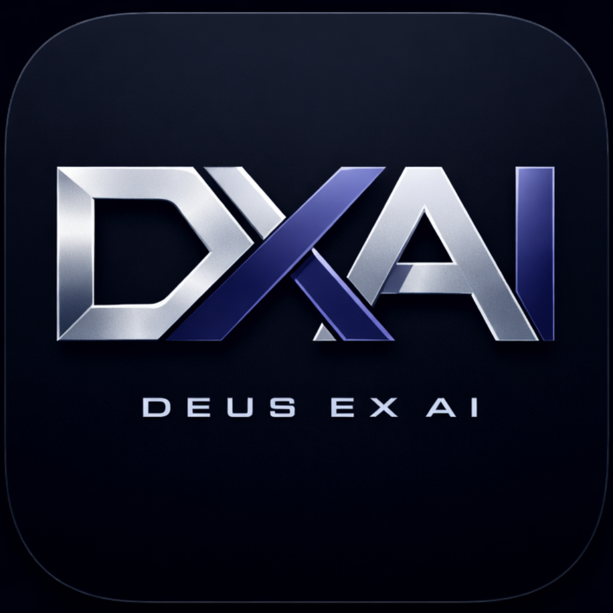
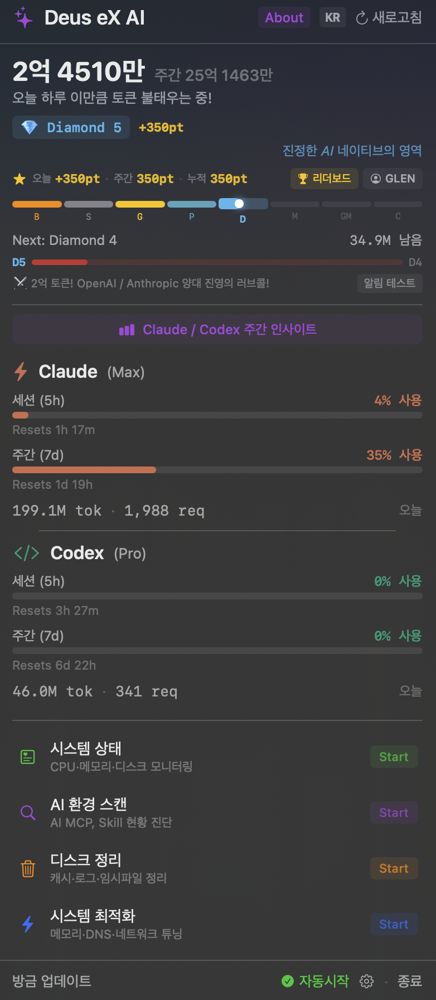
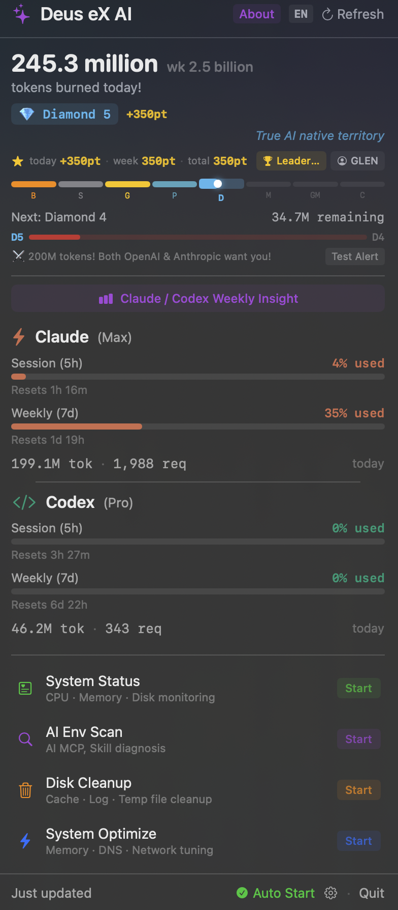
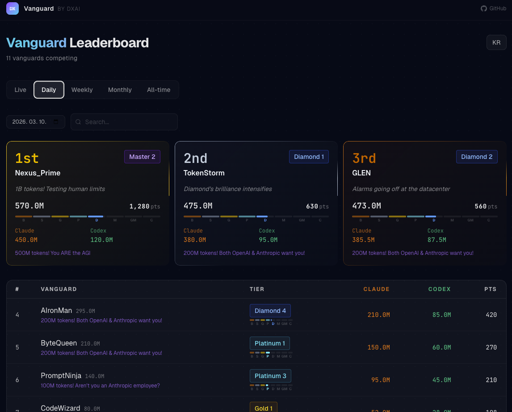

<div align="center">
  
  <h1>Deus eX AI</h1>
  <p><strong>macOS용 AI 개발 환경 매니저</strong></p>
  <p>토큰 추적, 쿼터 모니터링, 시스템 최적화 — 메뉴바 하나로.</p>
</div>

<p align="center">
  <a href="https://github.com/glen15/dxai/stargazers"></a>
  <a href="https://github.com/glen15/dxai/releases"></a>
  <a href="LICENSE"></a>
  <a href="README.md"></a>
  <a href="README.ko.md"></a>
</p>

## 설치

```bash
brew install --cask glen15/dxai/dxai
```

macOS 13 (Ventura) 이상. API 키 불필요.

---

<p align="center">
  
  
</p>

<p align="center">
  
</p>

---

## 주요 기능

- **토큰 대시보드** — Claude Code, Codex CLI 사용량 실시간 합산
- **쿼터 모니터링** — 5시간/7일 제한, 리셋 타이머
- **Vanguard 랭크** — 일일 사용량 기반 8등급 36레벨 (Bronze → Challenger)
- **Vanguard 리더보드** — opt-in 랭킹 ([vanguard.dx-ai.cloud](https://vanguard.dx-ai.cloud))
- **토큰 마일스톤** — 누적 달성 시 macOS 알림
- **시스템 관리** — 디스크 정리, 메모리 최적화, AI 환경 스캔
- **EN/KR** — 영어/한국어 완전 지원

---

## 데이터 안전

- 모든 데이터는 로컬 로그 파일(`.jsonl`)을 읽기 전용으로 파싱
- AI 도구 데이터(`~/.claude/`, `~/.codex/`)는 정리 대상에서 제외
- 리더보드 참여는 opt-in. 닉네임 + 토큰 수만 전송 (프롬프트/대화 내용 수집 없음)

---

## 크레딧

[Tw93](https://github.com/tw93)의 [Mole](https://github.com/tw93/Mole) (MIT)에서 영감을 받아, 시스템 관리 기반 위에 AI 토큰 추적과 게이미피케이션을 더했습니다.

## 라이선스

MIT License. [LICENSE](LICENSE) 참조.
